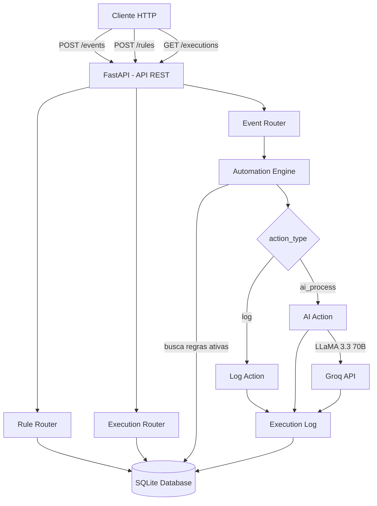

# Mini Automation Platform

Plataforma simplificada de automação baseada em eventos com suporte a IA.

## Sobre o projeto

O sistema permite cadastrar regras de automação que são disparadas automaticamente quando eventos chegam. Por exemplo: quando um usuário se cadastra, o sistema pode registrar um log ou processar os dados com IA.

## Arquitetura


## Design Patterns utilizados

- **Observer Pattern** — o engine observa eventos e notifica as ações correspondentes
- **Strategy Pattern** — cada tipo de ação (`log`, `ai_process`) é uma estratégia intercambiável
- **Repository Pattern** — acesso ao banco de dados isolado via SQLAlchemy

## Tecnologias

- Python 3.11
- FastAPI
- SQLAlchemy
- SQLite
- Docker
- Groq AI (LLaMA 3.3 70B)

## Integração com IA

A plataforma utiliza a API do **Groq** com o modelo **LLaMA 3.3 70B** para processar eventos com inteligência artificial.

Quando uma regra tem `action_type: "ai_process"`, o sistema envia o prompt configurado na regra junto com o payload do evento para o modelo de IA, que retorna uma resposta inteligente salva no log de execuções.

### Exemplo real de resposta da IA

Evento recebido:
```json
{
  "event_type": "ticket.created",
  "payload": {
    "titulo": "Sistema fora do ar",
    "descricao": "Todos os usuários estão sem acesso à plataforma desde as 9h"
  }
}
```

Resposta gerada pela IA:
```
Prioridade: ALTA
O sistema está fora do ar e todos os usuários estão sem acesso,
afetando diretamente a operação. Requer atenção imediata.
```

### Como configurar

Crie um arquivo `.env` na raiz do projeto:
```env
GROQ_API_KEY=sua_chave_aqui
```

Obtenha sua chave gratuita em: https://console.groq.com

## Como rodar

### Pré-requisitos
- Docker instalado

### Subir o projeto
```bash
git clone https://github.com/Tadokize/mini-automation-platform.git
cd mini-automation-platform
docker compose up --build
```

Acesse a documentação em: http://localhost:8000/docs

## Endpoints

### Eventos
- `POST /events` — registra um novo evento e dispara automações
- `GET /events` — lista todos os eventos

### Regras
- `POST /rules` — cria uma regra de automação
- `GET /rules` — lista todas as regras
- `DELETE /rules/{id}` — remove uma regra

### Execuções
- `GET /executions` — lista o histórico de execuções

## Exemplos de uso

### 1. Criar regra de log
```json
POST /rules
{
  "event_type": "user.registered",
  "action_type": "log",
  "action_config": "Novo usuário cadastrado"
}
```

### 2. Disparar evento do log
```json
POST /events
{
  "event_type": "user.registered",
  "payload": {
    "name": "João Silva",
    "email": "joao@email.com"
  }
}
```

### 3. Criar regra com IA
```json
POST /rules
{
  "event_type": "ticket.created",
  "action_type": "ai_process",
  "action_config": "Classifique a prioridade deste ticket como ALTA, MÉDIA ou BAIXA e explique o motivo em 2 linhas"
}
```

### 4. Disparar evento da IA
```json
POST /events
{
  "event_type": "ticket.created",
  "payload": {
    "titulo": "Sistema fora do ar",
    "descricao": "Todos os usuários estão sem acesso à plataforma desde as 9h"
  }
}
```

### 5. Ver execuções
```
GET /executions
```
